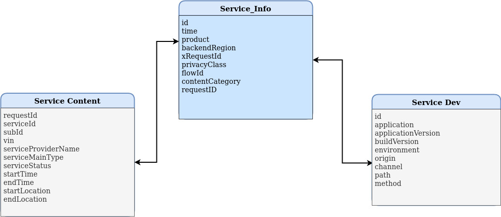

# Volvo-Assignment

## Requirements 
 - Java > 8. Ensure Java is installed and the Java Environment variable "JAVA_HOME" is properly setup.
 - OS Environment : Linux or MAC
 
## Environment Setup
The Environment used for the this assignment is based on the following:
 - Kafka 2.13-2.6.0
 - Python 3.6.0
 - Ubuntu 18.04
 - Java 11.0.8
 
### Getting Started
Run the below to start the necessary kafka server. The kafka server runs on localhost:9092 and zookeeper also runs on localhost:2181.
 - run the script "start-all-server.sh" : This will automatically launch the zookeeper and kafka in two seperate shells. It is importantly runs properly. If you already have an existing Kafka and Zookeeper running on those ports, then you don't need to launch this.
 
The impplementation for the producer and the consumer is based on Python as compared to Java or Scala. For working with Python, it will require using a kafka python library. The kafka-python library can be installed with pip. See below:
 - pip install kafka-python
 
 

## Question 1
For the Back End Team
 1. In the sample data provided, there is inconsistent formatting for the latitude location data. In the startLocation key, the latitude is a string and longitude is a number but in endlocation in which both are numbers. This lack of uniform can easily lead to errors and unnecessary conversion time.
 2. The string for backendRegion is `uswest2`, although this is just a code name to specify the region. It stills contain some information like the country name, direction (west, east, north, south). By having it in this current format `uswest2`, it is slightly more difficult to parse out the country, and other information. But if they consider an "-" based format like `us-west-2`, here we can simply find the country be picking the characters before an `"-"`.

For the Product Owners
 1. Most of the content in the JSON seems to have bounded values aside from the location, IDs, and time data. What this means is that might be limited knowledge or discovery that might be made. For example, it will be nice to provide a comment key which might shed light on why something like for example "service_providercancelled" occurred terminating the whole flowId transition.
 2. Assumed that serviceMainType tells the service carried out or requested, which seems there is more than one party involved in the transaction. The serviceProviderName and some unknown client or customer, this latter information is not provided for which might be a good addon for the business analyst side of things.

## Question 2
Suggest a schema for storing the events in a relational format for long-term storage. The data will be consumed mainly by business analysts. 
Provide the implementation script and reasoning behind your design decision.

### Storing the Events in a Relational Format for Long-term storage.
A relational database with 3 tables schema design is presented as shown in the image below:



Schema for storing in a relation database
#### Justification
The below are some of the reasons that was considered in justifying that schema presented:
 - The schema should be able to present the most important information to the user in this case optimized for a business analyst without feeling overwhelmed. At same time while providing the developers the possibility to go through the database for development important information.
 - In as much as possible, keep the relationship or hierarchy structure of the JSON as much as possible.
 - I advise having a 3 table relationship layout:
    - **Service_Info** Table: This table will hold the core service events information and also gives an overview of the service carried out. Based on this, it was decided that the table should house the 
    fields: ```'id', 'time', 'version', 'product', 'backendRegion', 'xRequestId', 'privacyClass', 'flowId', 'contentCategory'```. The `id` allows the table to be able to reference service contents data.
    - **Service_Content** Table: This table is responsible for the contents of the service delivered. It holds the service content data from the JSON data. It contains the following fields : ```'id', 'requestId', 'serviceId', 'subId', 'vin', 'serviceProviderName', 'serviceMainType', 'serviceStatus',
                   'startTime', 'endTime', 'startLocation', 'endLocation'```. The `predictedStartTime & predictedEndTime` is discarded considering there is little difference with the `startTime & endTime`. The information contained in both the `startLocation & endLocation` has been serialized as one single comma separated string like this `longitude,latitude = -122.034363,37.387703`. The reason behind is to reduce query time in fetching location information, and also making it simple to read.
    - **Service_Dev** Table: This table holds mostly development information about the service which not be that useful to buisness analyst but might still be important for debug, logging or referrence purpose. It is a seperated and is linked to the main Service_Info table using the `id` field. The table holds the following fields: ```'id', 'application', 'applicationVersion', 'buildVersion', 'environment', 'origin', 'channel', 'path', 'method'```                           
 - The **flowId** key can be used to cluster service transition together. We can use that to track how well a service events took.
 
### Schema Implementation.
The schema presented is implemented in the code in `main/src/solution2.py`. Here the 3 tables values are stored in the ```table_service_info, table_service_dev, table_service_content``` representing Service_Info, Service_Dev, Service_Content respectively. The output if the variables are a list of list signifying rows in table or 2D arrays.
The implementation code used the service_subset.json file. 
##### Running
The code can be run by launching `python3 solution2.py` in the terminal.

## Launching kafka 
Navigate to the main folder and the terminal can be launched from there.
--- Starts the zookeeper service:
`bin/zookeeper-server-start.sh config/zookeeper.properties
`
--- Starts the kafka broker service:
`bin/kafka-server-start.sh config/server.properties
`
--- Create topics
`bin/kafka-topics.sh --create --zookeeper localhost:2181 --replication-factor 1 --partitions 1 --topic python-trial
`
-- See topics 
`bin/kafka-topics.sh --list --bootstrap-server localhost:9092
`
## Question 3 - Consumer
Provide a script that consumes events from the Kafka topic `icl.analytics.events.service` and writes the data to Postgres in your suggested schema.

### Python Communication with Kafka
In order to provide support for communicating with Kafka, I am using the python-kafka binding/library.
The binding can be installed using pip:
`pip install kafka-python`

### Testing the Events Consumer
The code for this question is located in `main/src/solution3.py` and can be launched by running `python3 solution3.py` in the terminal. 
The data received from the Kafka topics is passed into the data transform, to convert the data to the required schema for the database. 

#### Setting up PostgresSQL
Install postgresql - 
`sudo apt-get install postgresql libpq-dev postgresql-client postgresql-client-common
`
Create a database : example db is "volvo_service_db_ayo"
```
Create a database in postgres : createdb "volvo_service_db_ayo"
```
Config the postgres database information like dbname, user and password in the `database.ini` configuration file located in `main/src/database.ini`. 
```
[postgresql]
host=localhost
database=volvo_service_db_ayo
user=ayo
password=12345
port=5432
```
#### Setting up python postgres binding
Install the psycopg2 library:
`pip install psycopg2`

#### Demo
With the Producer pushing service contents, the consumer will automatically reads events from the kafka topics and save it to the database "volvo_service_db_ayo"
The program can be run by launching `python3 solution3.py`. It should be showing something like this:
```
Starting up: Task 3 ---- Kafka Service Event Consumer
Consumer connected:  True
Connecting to the PostgreSQL database...
Unable to create table - Probably created -  relation "service_info" already exists

New event - Transformation complete
Writing to DB
New event - Transformation complete
Writing to DB
New event - Transformation complete
```
The content of the database can be viewed with pgAdmin 4 Desktop client

## Question 4 - Producer
Provide a script that produces messages to icl.analytics.events.service Kafka topic. You can read messages from `service_subset.json` file.

### Testing the Events Producer
The code for this question is located in `main/src/solution4.py` and can be launched by running `python3 solution4.py` in the terminal.
The program should and starting sending events loaded from the `service_subset.json` file which is located in `main/src/service_subset.json`. 
The json file can be modified to test the quality checker. NOTE: The json file has to be modified before running the program and not during the program execution.
The program should produce an output similar to the below:
```
Starting up: Task 4 ---- Kafka Service Event Producer
JSON File loaded
Producer connected:  True
sending ...  0
sending ...  1
sending ...  2
sending ...  3
sending ...  4
sending ...  5
```
## Question 5
What quality checks would you implement in order to mitigate issues with the data at arrival and how would you validate the output of your transforms? 
(Part of your answer may be provided in the code from questions 3-4)

### Ensuring Data Quality
The below are data quality that can be implemented especially on the producer of the events. Some of these quality checks are implemented
in the [Question 4](#question-4---producer) code in the `quality_checker` function.
 - Ensure the expected keys are received in the data packet. No more or No less. (_**Implemented in Question 4**_)
 - Alerts when field name are swapped leading to wrong ordering. (_**Implemented in Question 4**_ - A hash value is generated for the keys. Hash value is a numeric value of a fixed length that uniquely identifies data. 
 Both the expected key layout and the current key layout is compared to each other.)
 - Alerts when data type of a specified field changes 
 - Alerts when data of any field in the content section have values missing. (_**Implemented in Question 4**_ : Currently, achieved this by checking if the field value is empty)
 - Alerts when the id is not unique. The id is expected to be unique. This can be done with Hash or by tracking previous id
 - Using JSON Schema for datatype validation: We can setup a JSON schema to evaluate that the JSON Field data have the right datatype, have an enforced field. A schema for checking the datatype for the service data is shown below:
```yaml
{
  "type": "object",
  "properties": {
    "id": {"type": "string"},
    "time": {"type": "string"},
    "version": {"type": "string"},
    "product": {"type": "string"},
    "application": {"type": "string"},
    "applicationVersion": {"type": "string"},
    "buildVersion": {"type": "string"},
    "environment": {"type": "string"},
    "backendRegion": {"type": "string"},
    "origin": {"type": "string"},
    "channel": {"type": "string"},
    "path": {"type": "string"},
    "method": {"type": "string"},
    "xRequestId": {"type": "string"},
    "privacyClass": {"type": "string"},
    "flowId": {"type": "string"},
    "contentCategory": {"type": "string"},
    "content": {
      "type": "object",
      "properties": {
        "requestId": {"type": "string"},
        "serviceId": {"type": "string"},
        "subId": {"type": "string"},
        "vin": {"type": "string"},
        "serviceProviderName": {"type": "string"},
        "serviceMainType": {"type": "string"},
        "serviceStatus": {"type": "string"},
        "startTime": {"type": "string"},
        "endTime": {"type": "string"},
        "predictedStartTime": {"type": "string"},
        "predictedEndTime": {"type": "string"},
        "startLocation": {
          "type": "object",
          "properties": {
            "longitude": {"type": "number"},
            "latitude": {"type": "number"}
          }
        },
        "endLocation": {
          "type": "object",
          "properties": {
            "longitude": {"type": "number"},
            "latitude": {"type": "number"}
          }
        }
      }
    }
  }
}
```

For more powerful quality checks, one can consider:
 - Apache Griffin

### Validating the Transformation
 - One of the ways I am currently validating the output of my transformation from is by ensuring that transformation is carried on a predefined fields and 
 not dynamic fields as shown in the Service_Info Table Transform code snapshot below:
 ```python
    return [data[col] if col is not 'requestId' else data[content_name][col] for col in headers_service_info]
```
Here, I am ensuring I am only formatting known fields in `headers_service_info`. In this way, I can ensure a target schema will always be matched. 

 - In the Service Content, where there is a possibility of dynamic field from the JSON data in this case of location. Sometimes, the location information is not present in the service events data. In order to ensure consistent schema and transformation, I detect when the location data is not available and then create "NULL" value for that service record. A sample record of the Service_Content table without location data is shown below:
 ```python
['b6c11610-5955-11ea-97f8-4ec01af4c93c', '320807f7-6a05-4353-8b5b-db64eea5b33c', 'f81b8231-02df-448b-8b32-40bba90e009a', 'WNHWH835SFYAMHGWJ5NKK3', 'AIVD', 'DeliverToCar', 'ProviderCancelled', '2020-02-27T11:38:44Z', '2020-02-28T04:00:00Z', 'NULL', 'NULL']
```
and ofcourse, the "NULL" value can be replaced with something else.

## Question 6
Imagine that you have presented your solution to the extended team and are now responsible for setting up your solution in production. We expect an exponential increase of events received on the topic `icl.analytics.events.service`.
Elaborate on modifications, components and tools that you would consider in order to guarantee the quality of service and the integrity of data.

### Response
The below are some modifications, tools, components and others that will be considered in pivoting towards production.
 - Take advantage of `Kafka Stream` which allows for real time data processing running in a serverless architecture. 
 We can kafka stream app for the schema data transformation, and for managing data checks and quality as well. External platform like the Apache Griffin can also be incorporated
 for better data quality and test. 
 - Use Kafka Connect to move events directly from topics into Postgres database or any other related third party data consumer. This will be way more faster and efficient. 
 - More data redundancy will be considered.
 - A better transformation schema can also be considered that will be better than the presented one here.